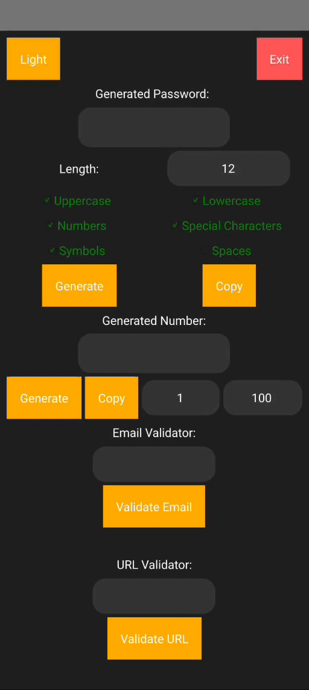

# Password & Number Generator with Validators 🛠️🔒
---


---
## Overview

---
Welcome to the **Password & Number Generator with Validators**! This desktop application allows you to generate random passwords and numbers, validate emails and URLs, and switch between dark and light modes. The app is built using **PySide6** and **QtPy**, offering a user-friendly interface with customizable options. 

## Features 🌟

- **Generate Passwords**: Create passwords of specified lengths with various complexity options.
- **Generate Numbers**: Randomly generate numbers within a specified range.
- **Email Validator**: Validate email addresses using regular expressions.
- **URL Validator**: Validate URLs using regular expressions.
- **Dark/Light Mode Toggle**: Switch between dark and light themes.
- **Copy to Clipboard**: Easily copy generated passwords and numbers.

## Installation 🛠️

1. **Clone the Repository**

   ```bash
   git clone https://github.com/mdriyadkhan585/Pass-NEGV-validators.git
   cd Pass-NEGV-validators
   ```

2. **Install Dependencies**

   Ensure you have Python installed. Then, install the required packages using pip:

   ```bash
   pip install PySide6
   pip install qtpy
   ```

## Usage 🚀

1. **Running the Application**

   To start the application, navigate to the project directory and run:

   ```bash
   python main.py
   ```

2. **Generating Passwords**

   - **Enter Password Length**: Specify the length of the password you want to generate in the "Password Length" input field.
   - **Select Options**: Check the boxes for the types of characters you want to include in the password (e.g., uppercase letters, lowercase letters, numbers, special characters, symbols, spaces).
   - **Generate Password**: Click the "Generate Password" button to create a new password.
   - **Copy Password**: Click the "Copy" button to copy the generated password to your clipboard.

3. **Generating Numbers**

   - **Set Range**: Enter the minimum and maximum values for the number generation.
   - **Generate Number**: Click the "Generate Number" button to create a random number within the specified range.
   - **Copy Number**: Click the "Copy" button to copy the generated number to your clipboard.

4. **Validating Email and URL**

   - **Email Validation**:
     - Enter the email address in the "Email Validator" input field.
     - Click "Validate Email" to check if the email address is valid.
     - The result will be displayed below the button.
   - **URL Validation**:
     - Enter the URL in the "URL Validator" input field.
     - Click "Validate URL" to check if the URL is valid.
     - The result will be displayed below the button.

5. **Switching Themes**

   - **Toggle Mode**: Click the "Switch to Light Mode" or "Switch to Dark Mode" button to change the application's theme.
   - **Exit Application**: Click the "Exit" button to close the application.

## Short Example 📸



## Customization 🎨

You can customize the styles and appearance of the application by modifying the `main.py` file. Adjust colors, fonts, and other UI elements to match your preferences.

## Contributing 🤝

If you would like to contribute to this project, please follow these steps:

1. Fork the repository.
2. Create a new branch for your changes.
3. Commit your changes and push to the branch.
4. Submit a pull request with a detailed description of your changes.

## License 📝

This project is licensed under the MIT License - see the [LICENSE](LICENSE) file for details.


---
